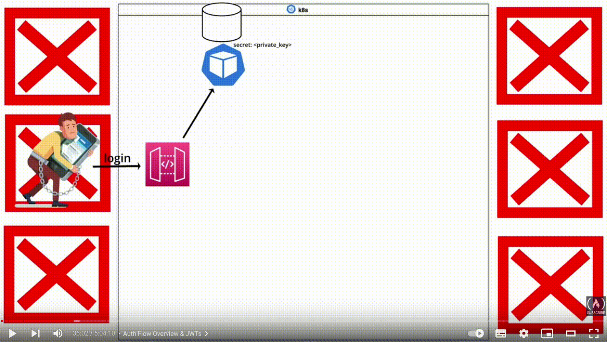

# Notes

## Overall Architecture


## Detailed Notes

### Init

Read [**here**](https://www.digitalocean.com/community/tutorials/how-to-install-mysql-on-ubuntu-20-04) to deal with the following error:

```bash
ERROR 1045: Access denied for user: 'root@localhost' (Using password: NO)
```

Create a user for the database.

```sql
CREATE USER 'auth_user'@'localhost' IDENTIFIED BY '@uth123!';
```

### Auth Flow Overview & JWT

Use `ffmpeg` to convert the video to gif. If there's an error with `width` or `height` not divisible by 2, read [**here**](https://stackoverflow.com/questions/20847674/ffmpeg-libx264-height-not-divisible-by-2).



### Kubernetes

**Kubernetes** is a **container orchestration tool**. It is used to manage containers in a cluster. It is a tool to **manage containers**, not a container itself.

From the documentation, **Kubernetes objects** are persistent entities in the Kubernetes system. A Kubernetes object is a `record of intent` -- once you create the object, the Kubernetes system will constantly work to ensure that object exists. By creating an object, you're effectively telling the Kubernetes system what you want your cluster's workload to look like; this is your cluster's `desired state`.

An example of a Kubernetes object.

```yaml
# /src/auth/manifests/auth-deploy.yaml
apiVersion: apps/v1
kind: Deployment
metadata:
  name: auth
  labels:
    app: auth
spec:
  replicas: 2
  selector:
    matchLabels:
      app: auth
  strategy:
    type: RollingUpdate
    rollingUpdate:
      maxSurge: 3
  template:
    metadata:
      labels:
        app: auth
    spec:
      containers:
        - name: auth
          image: ${DOCKER_ACCOUNT}/${DOCKER_REPO}
          resources:
            requests:
              memory: "128Mi"
              cpu: "500m"
            limits:
              memory: "128Mi"
              cpu: "500m"
          ports:
            - containerPort: ${PORT}
          envFrom:
            - configMapRef:
                name: auth-configmap
            - secretRef:
                name: auth-secret
```

Read [**here**](https://www.baeldung.com/linux/kubernetes-deployment-pass-environment-variable) to test different ways to pass environment variables to kubernetes deployment.

What we are doing is to use `envsubst` to replace the environment variables in the manifest file with the values in the current shell. In order to use `envsubst`, we need to install `gettext-base`.

```bash
envsubst < manifests/service.yaml | kubectl apply -f -
```

**Required fields**:
In the `.yaml` file for the Kubernetes object you want to create, you'll need to set values for the following fields:

- `apiVersion` - which version of the Kubernetes API you're using to create this object.
- `kind` - what kind of object you want to create.
- `metadata` - Data that helps uniquely identify the object, including a `name` string, `UID`, and optional `namespace`.
- `spec` - What state you desire for the object.

### Gateway

On the one hand, the API Gateway is tightly coupled with the `auth service`. This is an example of synchronous communication between services.

On the other hand, the API Gateway is asynchronously communicating with the `video to mp3 service` via a queue manager. Thus, this allows the API Gateway to serve more requests. This is an example of asynchronous communication between services.

Eventual consistency vs. strong consistency.

### RabbitMQ

Read [**here**](https://www.cloudamqp.com/blog/part1-rabbitmq-for-beginners-what-is-rabbitmq.html) for more information.

**RabbitMQ** is a **message broker** or **queue manager**. Simply said, it is a software where queues are defined, to which applications connect in order to transfer a message or messages.


**Message queueing** allows web servers to respond to requests quickly instead of being forced to perform resource-heavy procedures on the spot. Message queueing is also good when you want to **distribute a message to multiple consumers** or to **balance loads between workers**.


**Message flow** in RabbitMQ:


1. The producer publishes a message to an **exchange**, which is responsible for routing the messages to different queues with the help of bindings and routing keys. When creating an exchange, the type must be specified.
1. The exchange receives the message and is now responsible for routing the message. The exchange takes different message attributes into account, such as the routing key, depending on the exchange type.
1. Bindings must be created from the exchange to queues. In this case, there are 2 bindings to 2 different queue from the exchange. The exchange routes the message into the queues depending on message attributes.
1. The messages stay in the queue until they are handled by a consumer.
1. The consumer handles the message.


### Kubernetes Ingress

**Kubernetes Services** are an abstraction layer which defines a logical set of Pods and enables external traffic exposure, load balancing and service discovery for those Pods.


**Kubernetes Ingress** is an API object that helps developers expose their applications and manage external access by providing http/s routing rules to the services within a Kubernetes cluster.


**Ingress** in the project:


**Kubernetes Egress** is a Kubernetes resource that allows the cluster to connect to an external database, API, or service.

From the vantage point of a Kubernetes pod, Ingress rules govern traffic originating from external connections coming into the pod, whereas Egress rules govern traffic arising from within the pod heading externally.

**NOTE**: edit `/etc/hosts` to map `mp3converter.com` to `localhost`.

```
# /etc/hosts
127.0.0.1 mp3converter.com
```

We need to enable `minikube ingress` addon.

```bash
minikube addons enable ingress
```

**NOTE**: Be carefully not to name the `PORT` variable as `${APP_NAME}_PORT` because `minikube` will suspectedly (I haven't verified) automatically create a service for the deployment with the name `${APP_NAME}_PORT`. Thus, we'll run into a problem where the docker image runs on its own but refuses to run in `minikube`. This was what happened to me, and I had to change the name of the variable to `PORT_${AUTH_NAME}`.

To scale the deployment, we can use the following command.

```bash
kubectl scale deployment --replicas=0 ${APP_NAME}
```

### Kubernetes StatefulSet

From the [official doc](https://kubernetes.io/docs/concepts/workloads/controllers/statefulset/), **StatefulSet** is the workload API object used to manage stateful applications. Manages the deployment and scaling of a set of Pods, and *provides guarantees about the ordering and uniqueness* of these pods.

Like a Deployment, a StatefulSet manages Pods that are based on an identical container spec. Unlike a Deployment, a StatefulSet maintains a sticky identity for each of its Pods. These pods are created from the same spec, but are not interchangeable: each has a persistent identifier that it maintains across any rescheduling.


We want to use `StatefulSet` to deploy `RabbitMQ` because we want to have a persistent volume for the `RabbitMQ` pod. This is because we want to persist the messages in the queue even if the pod is restarted.


We'll mount the physical storage on our local disk to the **container instance**. The storage volume that was mounted to the local disk will remain intact even if the container instance dies for whatever reasons. When the new pod is deployed, the storage volume will be mounted to the container instance again.

**Deployment vs. StatefulSet**:


I have to use the following command to test `rabbitmq` ui. Read more [here](https://minikube.sigs.k8s.io/docs/handbook/accessing/).

```bash
minikube service rabbitmq --url
```
